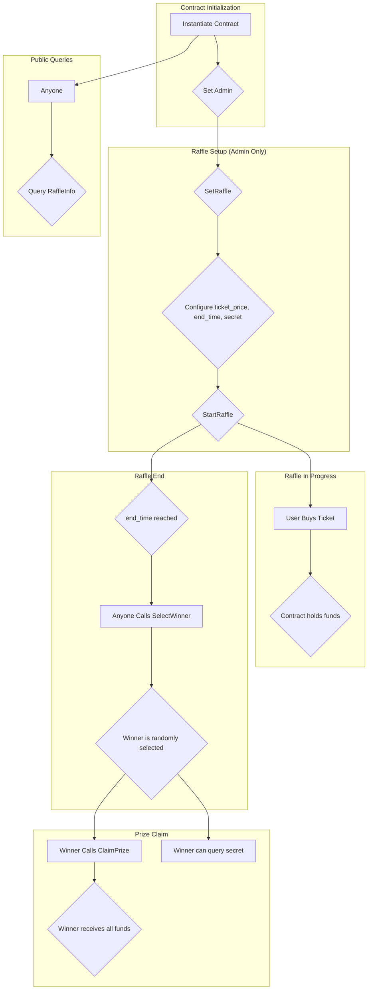

```mermaid

graph TD
    subgraph "Contract Initialization"
        A[Instantiate Contract] --> B{Set Admin};
    end

    subgraph "Raffle Setup (Admin Only)"
        B --> C{SetRaffle};
        C --> D{Configure ticket_price, end_time, secret};
        D --> E{StartRaffle};
    end

    subgraph "Raffle In Progress"
        E --> F[User Buys Ticket];
        F --> G{Contract holds funds};
    end

    subgraph "Raffle End"
        E --> H{end_time reached};
        H --> I[Anyone Calls SelectWinner];
        I --> J{Winner is randomly selected};
    end

    subgraph "Prize Claim"
        J --> K[Winner Calls ClaimPrize];
        K --> L{Winner receives all funds};
        J --> M[Winner can query secret];
    end

    subgraph "Public Queries"
        O[Anyone] --> P{Query RaffleInfo};
    end

    A --> O;
```
