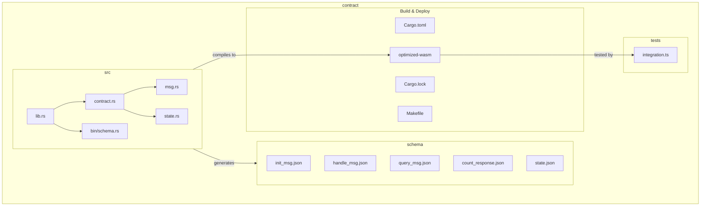

```mermaid
graph TD;
    subgraph "contract"
        subgraph "src"
            direction LR
            lib_rs["lib.rs"] --> contract_rs["contract.rs"];
            contract_rs --> msg_rs["msg.rs"];
            contract_rs --> state_rs["state.rs"];
            lib_rs --> bin_schema_rs["bin/schema.rs"];
        end

        subgraph "schema"
            direction TB
            init_msg_json["init_msg.json"];
            handle_msg_json["handle_msg.json"];
            query_msg_json["query_msg.json"];
            count_resp_json["count_response.json"];
            state_json["state.json"];
        end

        subgraph "tests"
            direction TB
            integration_ts["integration.ts"];
        end

        subgraph "Build & Deploy"
            direction TB
            cargo["Cargo.toml"];
            cargo_lock["Cargo.lock"];
            makefile["Makefile"];
            optimized_wasm["optimized-wasm"];
        end

        src -->|generates| schema;
        src -->|compiles to| optimized_wasm;
        optimized_wasm -->|tested by| integration_ts;

    end
```