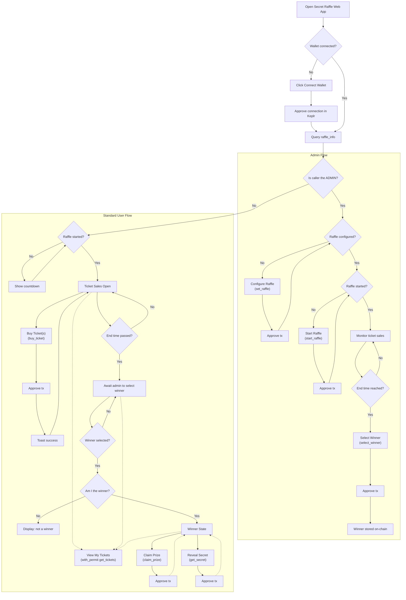

```mermaid
flowchart TD
    %% ---------------- Shared Entry ----------------
    Start["Open Secret Raffle Web App"] --> WalletCheck{"Wallet connected?"}
    WalletCheck -- "No" --> ConnectPrompt["Click "Connect Wallet""]
    ConnectPrompt --> KeplrApprove["Approve connection in Keplr"]
    KeplrApprove --> FetchInfo["Query raffle_info"]
    WalletCheck -- "Yes" --> FetchInfo

    %% Role split
    FetchInfo --> RoleCheck{"Is caller the ADMIN?"}

    %% ---------------- Admin Flow ----------------
    subgraph Admin_Flow["Admin Flow"]
        RoleCheck -- "Yes" --> RaffleConfigured{"Raffle configured?"}
        RaffleConfigured -- "No" --> Configure["Configure Raffle<br>(set_raffle)"]
        Configure --> ConfigTx["Approve tx"]
        ConfigTx --> RaffleConfigured

        RaffleConfigured -- "Yes" --> RaffleStarted{"Raffle started?"}
        RaffleStarted -- "No" --> StartBtn["Start Raffle<br>(start_raffle)"]
        StartBtn --> StartTx["Approve tx"]
        StartTx --> RaffleStarted

        RaffleStarted -- "Yes" --> AdminWait["Monitor ticket sales"]
        AdminWait --> EndPassed{"End time reached?"}
        EndPassed -- "No" --> AdminWait
        EndPassed -- "Yes" --> SelectWinner["Select Winner<br>(select_winner)"]
        SelectWinner --> WinnerTx["Approve tx"]
        WinnerTx --> AdminDone["Winner stored on-chain"]
    end

    %% ---------------- User Flow ----------------
    subgraph User_Flow["Standard User Flow"]
        RoleCheck -- "No" --> SaleOpen{"Raffle started?"}
        SaleOpen -- "No" --> Countdown["Show countdown"]
        Countdown --> SaleOpen

        SaleOpen -- "Yes" --> UserActive["Ticket Sales Open"]
        UserActive --> BuyTicket["Buy Ticket(s)<br>(buy_ticket)"]
        BuyTicket --> BuyTx["Approve tx"]
        BuyTx --> BuyDone["Toast success"]
        BuyDone --> UserActive
        %% Loop for multiple purchases
        UserActive -.-> ViewTickets["View My Tickets<br>(with_permit get_tickets)"]

        UserActive --> CheckEnd{"End time passed?"}
        CheckEnd -- "No" --> UserActive
        CheckEnd -- "Yes" --> WaitAdmin["Await admin to select winner"]
        WaitAdmin -.-> ViewTickets
        WaitAdmin --> WinnerSelected{"Winner selected?"}
        WinnerSelected -- "No" --> WaitAdmin
        WinnerSelected -- "Yes" --> AmWinner{"Am I the winner?"}
        AmWinner -- "No" --> NotWinner["Display: not a winner"]
        AmWinner -- "Yes" --> WinnerState["Winner State"]

        %% Winner actions
        WinnerState --> ClaimPrize["Claim Prize<br>(claim_prize)"]
        WinnerState --> RevealSecret["Reveal Secret<br>(get_secret)"]
        ClaimPrize --> PrizeTx["Approve tx"]
        RevealSecret --> SecretQuery["Approve tx"]
        PrizeTx -.-> WinnerState
        SecretQuery -.-> WinnerState
        WinnerState -.-> ViewTickets
    end
```