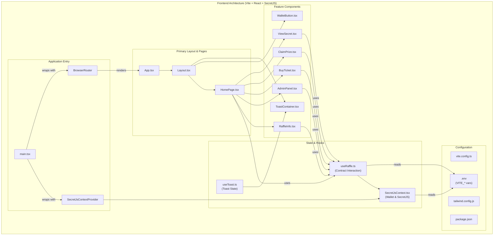

```mermaid
graph TD;
    subgraph "Frontend Architecture (Vite + React + SecretJS)"
        %% -----------------------------------------------------------------
        %% Application Entry
        %% -----------------------------------------------------------------
        subgraph "Application Entry"
            direction TB
            main_tsx["main.tsx"]
            SecretJsProvider["SecretJsContextProvider"]
            BrowserRouter["BrowserRouter"]
        end

        %% -----------------------------------------------------------------
        %% Core Layout & Pages
        %% -----------------------------------------------------------------
        subgraph "Primary Layout & Pages"
            direction TB
            App_tsx["App.tsx"]
            Layout_tsx["Layout.tsx"]
            HomePage_tsx["HomePage.tsx"]
        end

        %% -----------------------------------------------------------------
        %% Feature-level UI Components
        %% -----------------------------------------------------------------
        subgraph "Feature Components"
            direction TB
            RaffleInfo_tsx["RaffleInfo.tsx"]
            AdminPanel_tsx["AdminPanel.tsx"]
            BuyTicket_tsx["BuyTicket.tsx"]
            ClaimPrize_tsx["ClaimPrize.tsx"]
            ViewSecret_tsx["ViewSecret.tsx"]
            WalletButton_tsx["WalletButton.tsx"]
            ToastContainer_tsx["ToastContainer.tsx"]
        end

        %% -----------------------------------------------------------------
        %% State Management & Hooks
        %% -----------------------------------------------------------------
        subgraph "State & Hooks"
            direction TB
            SecretJsContext["SecretJsContext.tsx<br/>(Wallet & SecretJS)"]
            useRaffle["useRaffle.ts<br/>(Contract Interaction)"]
            useToast["useToast.ts<br/>(Toast State)"]
        end

        %% -----------------------------------------------------------------
        %% Configuration
        %% -----------------------------------------------------------------
        subgraph "Configuration"
            direction TB
            ViteConfig["vite.config.ts"]
            TailwindConfig["tailwind.config.js"]
            PackageJson["package.json"]
            EnvVars[".env<br/>(VITE_* vars)"]
        end

        %% -----------------------------------------------------------------
        %% Relationships
        %% -----------------------------------------------------------------
        main_tsx -->|"wraps with"| SecretJsProvider
        SecretJsProvider --> SecretJsContext
        main_tsx -->|"wraps with"| BrowserRouter
        BrowserRouter -->|"renders"| App_tsx
        App_tsx --> Layout_tsx
        Layout_tsx --> HomePage_tsx
        Layout_tsx --> WalletButton_tsx
        Layout_tsx --> ToastContainer_tsx

        HomePage_tsx -->|"uses"| useRaffle
        HomePage_tsx --> RaffleInfo_tsx
        HomePage_tsx --> AdminPanel_tsx
        HomePage_tsx --> BuyTicket_tsx
        HomePage_tsx --> ClaimPrize_tsx
        HomePage_tsx --> ViewSecret_tsx

        RaffleInfo_tsx -->|"uses"| useRaffle
        AdminPanel_tsx -->|"uses"| useRaffle
        BuyTicket_tsx -->|"uses"| useRaffle
        ClaimPrize_tsx -->|"uses"| useRaffle
        ViewSecret_tsx -->|"uses"| useRaffle

        useRaffle --> SecretJsContext
        useRaffle -->|"reads"| EnvVars
        SecretJsContext -->|"reads"| EnvVars

        useToast --> ToastContainer_tsx
    end
```