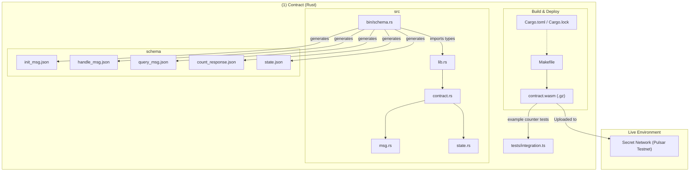
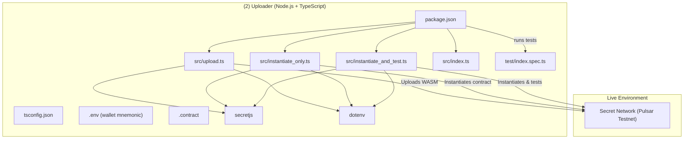
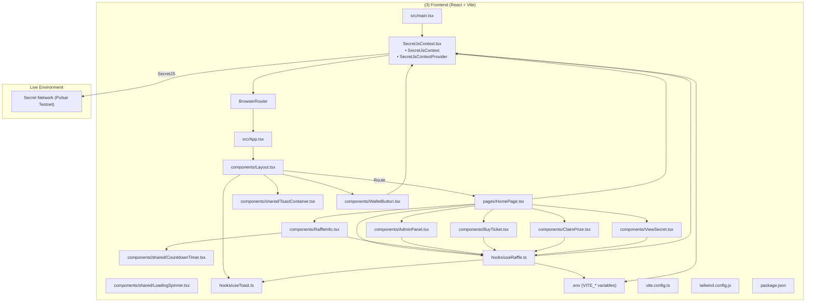
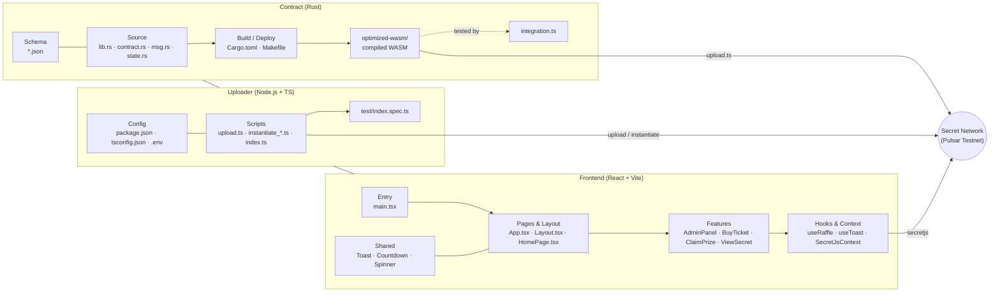

# Secret Raffle Monorepo Contract Structure Diagram

# Secret Raffle Monorepo Uploader Structure Diagram

# Secret Raffle Monorepo Frontend Structure Diagram

# Secret Raffle Monorepo Structure Diagram
