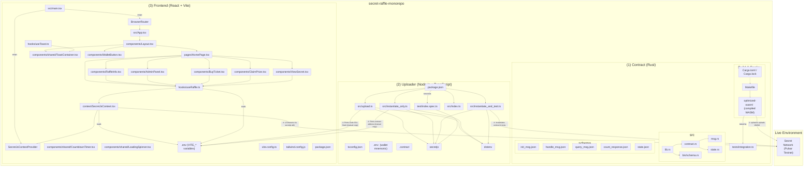

```mermaid
%%{init: {'themeCSS': '.label { font-size: 30px; } .edgeLabel { font-size: 20px; } .cluster-label { font-size: 40px; }'}}%%
flowchart TD
 subgraph src["src"]
    direction LR
        contract_rs["contract.rs"]
        lib_rs["lib.rs"]
        msg_rs["msg.rs"]
        state_rs["state.rs"]
        schema_rs["bin/schema.rs"]
  end
 subgraph subGraph1["Build & Deploy"]
    direction TB
        cargo_toml["Cargo.toml / Cargo.lock"]
        makefile["Makefile"]
        optimized_wasm["optimized-wasm/  (compiled WASM)"]
  end
 subgraph schema["schema"]
    direction TB
        init_msg["init_msg.json"]
        handle_msg["handle_msg.json"]
        query_msg["query_msg.json"]
        count_resp["count_response.json"]
        state_json["state.json"]
  end
 subgraph subGraph3["(1) Contract  (Rust)"]
    direction TB
        src
        subGraph1
        schema
        tests_ts["tests/integration.ts"]
  end
 subgraph subGraph4["(2) Uploader  (Node.js + TypeScript)"]
    direction TB
        upload_ts["src/upload.ts"]
        inst_only_ts["src/instantiate_only.ts"]
        inst_and_test_ts["src/instantiate_and_test.ts"]
        index_ts["src/index.ts"]
        unit_test["test/index.spec.ts"]
        uploader_pkg_json["package.json"]
        uploader_tsconfig["tsconfig.json"]
        uploader_env[".env  (wallet mnemonic)"]
        uploader_contract_file[".contract"]
        secretjs_dep["secretjs"]
        dotenv_dep["dotenv"]
  end
 subgraph subGraph5["(3) Frontend  (React + Vite)"]
    direction TB
        secret_provider["SecretJsContextProvider"]
        main_tsx["src/main.tsx"]
        router["BrowserRouter"]
        layout_tsx["components/Layout.tsx"]
        app_tsx["src/App.tsx"]
        home_page["pages/HomePage.tsx"]
        raffle_info["components/RaffleInfo.tsx"]
        admin_panel["components/AdminPanel.tsx"]
        buy_ticket["components/BuyTicket.tsx"]
        claim_prize["components/ClaimPrize.tsx"]
        view_secret["components/ViewSecret.tsx"]
        toast_container["components/shared/ToastContainer.tsx"]
        toast_timer["components/shared/CountdownTimer.tsx"]
        loading_spinner["components/shared/LoadingSpinner.tsx"]
        wallet_btn["components/WalletButton.tsx"]
        use_raffle["hooks/useRaffle.ts"]
        use_toast["hooks/useToast.ts"]
        secret_context["context/SecretJsContext.tsx"]
        frontend_env[".env (VITE_* variables)"]
        vite_config["vite.config.ts"]
        tailwind_config["tailwind.config.js"]
        package_json["package.json"]
  end
 subgraph s1["secret-raffle-monorepo"]
    direction LR
        subGraph3
        subGraph4
        subGraph5
  end
 subgraph subGraph7["Live Environment"]
        secret_network["Secret Network (Pulsar Testnet)"]
  end
    lib_rs --> contract_rs & schema_rs
    contract_rs --> msg_rs & state_rs
    cargo_toml -.-> makefile
    makefile --> optimized_wasm
    optimized_wasm -- tested by --> tests_ts
    uploader_pkg_json --> upload_ts & inst_only_ts & inst_and_test_ts & index_ts
    uploader_pkg_json -- runs tests --> unit_test
    upload_ts --> secretjs_dep & dotenv_dep
    inst_only_ts --> secretjs_dep & dotenv_dep
    inst_and_test_ts --> secretjs_dep & dotenv_dep
    unit_test --> secretjs_dep
    main_tsx -- wraps --> secret_provider & router
    router --> app_tsx
    app_tsx --> layout_tsx
    layout_tsx --> home_page & toast_container & wallet_btn
    home_page --> raffle_info & admin_panel & buy_ticket & claim_prize & view_secret & use_raffle
    raffle_info --> use_raffle
    admin_panel --> use_raffle
    buy_ticket --> use_raffle
    claim_prize --> use_raffle
    view_secret --> use_raffle
    use_raffle --> secret_context
    secret_context --> secret_provider
    use_toast --> toast_container
    secret_context -- reads --> frontend_env
    use_raffle -- reads --> frontend_env
    optimized_wasm -- "① upload.ts uploads WASM" --> secret_network
    upload_ts -- ② Prints Code ID & Hash (manual copy) --> frontend_env
    inst_and_test_ts -- ③ Instantiates contract & tests --> secret_network
    inst_only_ts -- ④ Prints contract address (manual copy) --> frontend_env
    secret_context -- ⑤ UI interacts via secretjs with --> secret_network
```