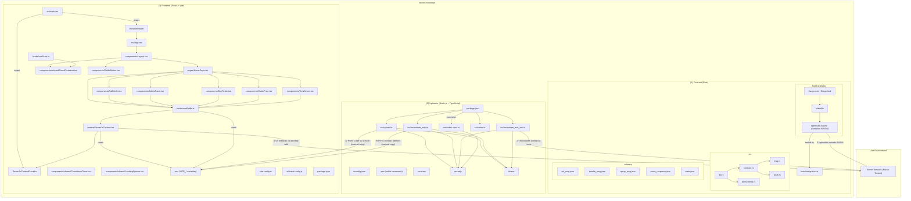

```mermaid
graph TD;
    %% ---------------------------------------------
    %% Root Monorepo layer
    %% ---------------------------------------------
    subgraph "secret-monorepo"
        direction LR;

        %% =============== CONTRACT =================
        subgraph "(1) Contract  (Rust)"
            direction TB;

            %% ---- Source tree ----
            subgraph "src"
                direction LR;
                lib_rs["lib.rs"] --> contract_rs["contract.rs"];
                contract_rs --> msg_rs["msg.rs"];
                contract_rs --> state_rs["state.rs"];
                lib_rs --> schema_rs["bin/schema.rs"];
            end

            %% ---- Build artefacts ----
            subgraph "Build & Deploy"
                direction TB;
                cargo_toml["Cargo.toml / Cargo.lock"];
                makefile["Makefile"];
                optimized_wasm["optimized-wasm/  (compiled WASM)"];
                cargo_toml -.-> makefile;
                makefile --> optimized_wasm;
            end

            %% ---- JSON schema ----
            subgraph "schema"
                direction TB;
                init_msg["init_msg.json"];
                handle_msg["handle_msg.json"];
                query_msg["query_msg.json"];
                count_resp["count_response.json"];
                state_json["state.json"];
            end

            %% ---- Test ----
            tests_ts["tests/integration.ts"];

            optimized_wasm -->|tested by| tests_ts;
        end

        %% =============== UPLOADER =================
        subgraph "(2) Uploader  (Node.js + TypeScript)"
            direction TB;

            %% Core scripts
            upload_ts["src/upload.ts"]; 
            inst_only_ts["src/instantiate_only.ts"]; 
            inst_and_test_ts["src/instantiate_and_test.ts"]; 
            index_ts["src/index.ts"];

            %% Tests
            unit_test["test/index.spec.ts"];

            %% Config & build
            uploader_pkg_json["package.json"];
            uploader_tsconfig["tsconfig.json"];
            uploader_env[".env  (wallet mnemonic)"];
            uploader_contract_file[".contract"];

            %% Dependencies
            secretjs_dep["secretjs"];
            dotenv_dep["dotenv"];

            %% Relationships
            uploader_pkg_json --> upload_ts;
            uploader_pkg_json --> inst_only_ts;
            uploader_pkg_json --> inst_and_test_ts;
            uploader_pkg_json --> index_ts;
            uploader_pkg_json -->|runs tests| unit_test;

            upload_ts --> secretjs_dep;
            inst_only_ts --> secretjs_dep;
            inst_and_test_ts --> secretjs_dep;
            unit_test --> secretjs_dep;

            upload_ts --> dotenv_dep;
            inst_only_ts --> dotenv_dep;
            inst_and_test_ts --> dotenv_dep;
        end

        %% =============== FRONTEND =================
        subgraph "(3) Frontend  (React + Vite)"
            direction TB;

            %% Entry
            main_tsx["src/main.tsx"] -->|wraps| secret_provider["SecretJsContextProvider"];
            main_tsx -->|wraps| router["BrowserRouter"];

            %% Layout & Pages
            router --> app_tsx["src/App.tsx"] --> layout_tsx["components/Layout.tsx"];
            layout_tsx --> home_page["pages/HomePage.tsx"];

            %% Feature components
            home_page --> raffle_info["components/RaffleInfo.tsx"];
            home_page --> admin_panel["components/AdminPanel.tsx"];
            home_page --> buy_ticket["components/BuyTicket.tsx"];
            home_page --> claim_prize["components/ClaimPrize.tsx"];
            home_page --> view_secret["components/ViewSecret.tsx"];

            %% Shared components & Hooks
            toast_container["components/shared/ToastContainer.tsx"];
            toast_timer["components/shared/CountdownTimer.tsx"];
            loading_spinner["components/shared/LoadingSpinner.tsx"];
            wallet_btn["components/WalletButton.tsx"];
            use_raffle["hooks/useRaffle.ts"];
            use_toast["hooks/useToast.ts"];
            secret_context["context/SecretJsContext.tsx"];

            layout_tsx --> toast_container;
            layout_tsx --> wallet_btn;

            home_page --> use_raffle;
            raffle_info --> use_raffle;
            admin_panel --> use_raffle;
            buy_ticket --> use_raffle;
            claim_prize --> use_raffle;
            view_secret --> use_raffle;

            use_raffle --> secret_context;
            secret_context --> secret_provider;

            use_toast --> toast_container;

            %% Config
            frontend_env[".env (VITE_* variables)"];
            vite_config["vite.config.ts"];
            tailwind_config["tailwind.config.js"];
            package_json["package.json"];

            secret_context -->|reads| frontend_env;
            use_raffle -->|reads| frontend_env;
        end
    end

    %% ---------------------------------------------
    %% Live Environment
    %% ---------------------------------------------
    subgraph "Live Environment"
        secret_network["Secret Network (Pulsar Testnet)"];
    end

    %% ---------------------------------------------
    %% Data Flow across workspaces
    %% ---------------------------------------------
    optimized_wasm -- "① upload.ts uploads WASM" --> secret_network;
    upload_ts -- "② Prints Code ID & Hash (manual copy)" --> frontend_env;
    inst_and_test_ts -- "③ Instantiates contract & tests" --> secret_network;
    inst_only_ts -- "④ Prints contract address (manual copy)" --> frontend_env;

    secret_context -- "⑤ UI interacts via secretjs with" --> secret_network;
```