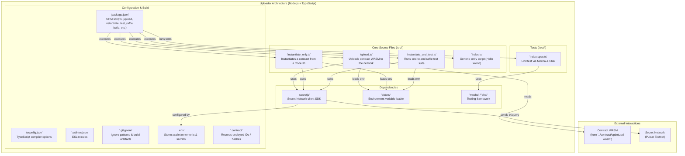

```mermaid
graph TD;
    subgraph "Uploader Architecture (Node.js + TypeScript)"

        subgraph "Core Source Files ('src/')"
            direction TB
            upload_ts["'upload.ts'<br/>Uploads contract WASM to the network"]
            instantiate_only_ts["'instantiate_only.ts'<br/>Instantiates a contract from a Code ID"]
            instantiate_and_test_ts["'instantiate_and_test.ts'<br/>Runs end-to-end raffle test suite"]
            index_ts["'index.ts'<br/>Generic entry script (Hello World)"]
        end

        subgraph "Tests ('test/')"
            direction TB
            unit_test["'index.spec.ts'<br/>Unit test via Mocha & Chai"]
        end

        subgraph "Configuration & Build"
            direction TB
            package_json["'package.json'<br/>NPM scripts (upload, instantiate, test_raffle, build, etc.)"]
            tsconfig_json["'tsconfig.json'<br/>TypeScript compiler options"]
            eslintrc_json["'.eslintrc.json'<br/>ESLint rules"]
            gitignore_file["'.gitignore'<br/>Ignore patterns & build artefacts"]
            env_file["'.env'<br/>Stores wallet mnemonic & secrets"]
            contract_file["'.contract'<br/>Records deployed IDs / hashes"]
        end

        subgraph "Dependencies"
            direction TB
            secretjs_dep["'secretjs'<br/>Secret Network client SDK"]
            dotenv_dep["'dotenv'<br/>Environment variable loader"]
            mocha_dep["'mocha' / 'chai'<br/>Testing framework"]
        end

        %% -- Script execution relationships -- %%
        package_json -->|executes| upload_ts;
        package_json -->|executes| instantiate_only_ts;
        package_json -->|executes| instantiate_and_test_ts;
        package_json -->|executes| index_ts;
        package_json -->|runs tests| unit_test;

        %% -- Dependencies usage -- %%
        upload_ts -->|uses| secretjs_dep;
        instantiate_only_ts -->|uses| secretjs_dep;
        instantiate_and_test_ts -->|uses| secretjs_dep;
        unit_test -->|uses| mocha_dep;

        upload_ts -->|loads env| dotenv_dep;
        instantiate_only_ts -->|loads env| dotenv_dep;
        instantiate_and_test_ts -->|loads env| dotenv_dep;

        secretjs_dep -->|configured by| env_file;
    end

    subgraph "External Interactions"
        direction LR
        contract_wasm["Contract WASM<br/>(from '../contract/optimized-wasm')"]
        secret_network["Secret Network<br/>(Pulsar Testnet)"]
    end

    upload_ts -->|reads| contract_wasm;
    secretjs_dep -->|sends tx/query| secret_network;
```